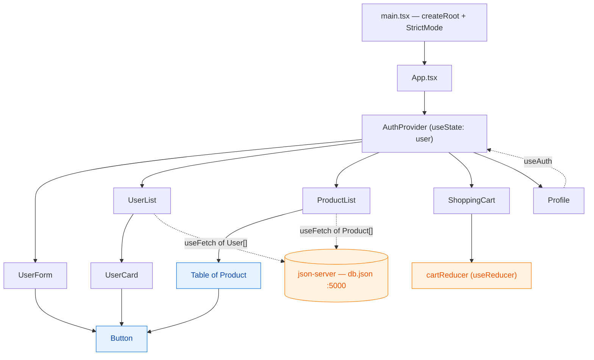
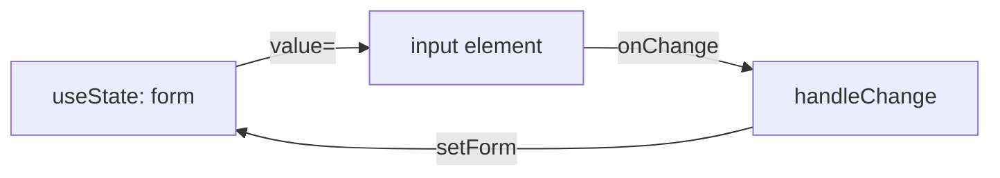
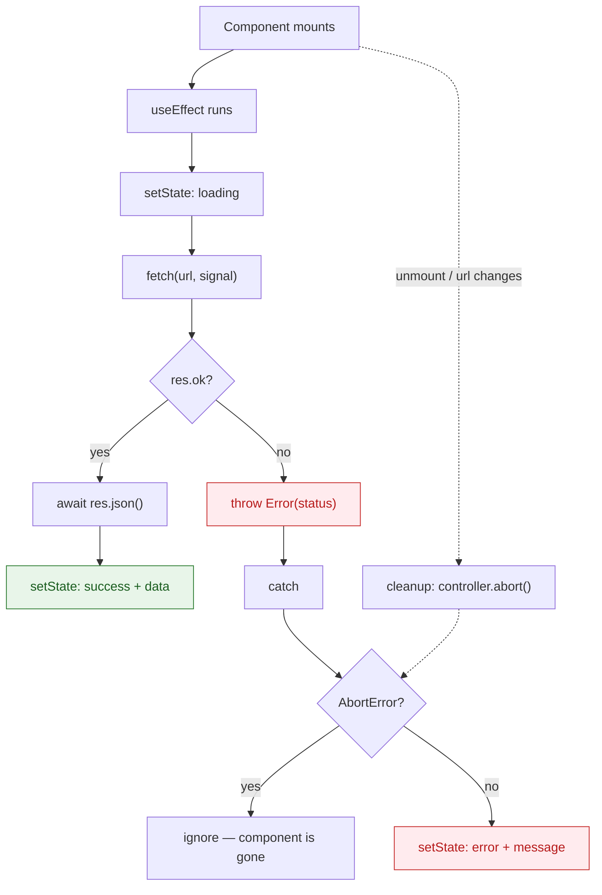
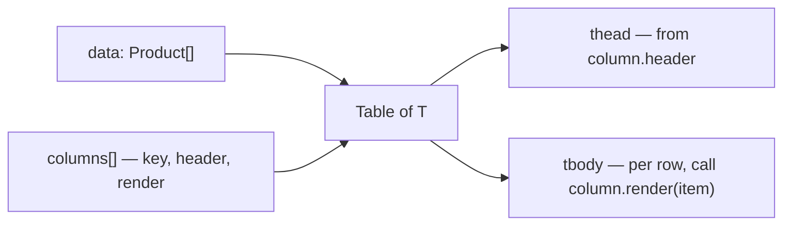
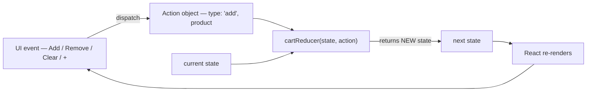
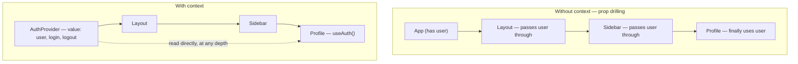

# React + TypeScript Learning Project

A hands-on playground for learning **React 19 with TypeScript**, built one concept at a time.
Each commit introduces exactly one idea — typed props, controlled forms, custom hooks, generics,
`useReducer`, Context — so the repo doubles as a readable learning path rather than a finished app.

Data comes from a local **json-server** fake REST API (`db.json`), so the fetching code is real
network code without needing a backend.

---

## Table of contents

- [What's inside](#whats-inside)
- [Tech stack](#tech-stack)
- [Getting started](#getting-started)
- [Project structure](#project-structure)
- [Architecture at a glance](#architecture-at-a-glance)
- [The learning path](#the-learning-path)
- [Concepts explained](#concepts-explained)
  - [1. Typing component props](#1-typing-component-props)
  - [2. Literal union types](#2-literal-union-types)
  - [3. Controlled forms](#3-controlled-forms)
  - [4. Fetching data with useEffect](#4-fetching-data-with-useeffect)
  - [5. Discriminated unions for async state](#5-discriminated-unions-for-async-state)
  - [6. Custom hooks](#6-custom-hooks)
  - [7. Generics in components and hooks](#7-generics-in-components-and-hooks)
  - [8. useReducer for complex state](#8-usereducer-for-complex-state)
  - [9. Context API for shared state](#9-context-api-for-shared-state)
- [Which state tool when?](#which-state-tool-when)
- [Rough edges & exercises](#rough-edges--exercises)
- [Scripts](#scripts)

---

## What's inside

| Feature | File | Concepts it teaches |
| --- | --- | --- |
| **User form** | [src/user-form/UserForm.tsx](src/user-form/UserForm.tsx) | Controlled inputs, `useState` with an object, typed events, CSS Modules |
| **User list** | [src/user-list/UserList.tsx](src/user-list/UserList.tsx) | Data fetching, discriminated-union state, list rendering, callback props |
| **Product list** | [src/product-list/ProductList.tsx](src/product-list/ProductList.tsx) | Generic `Table<T>`, column config, render props |
| **Shopping cart** | [src/shopping-cart/ShoppingCart.tsx](src/shopping-cart/ShoppingCart.tsx) | `useReducer`, action unions, immutable updates |
| **Profile / auth** | [src/pages/Profile.tsx](src/pages/Profile.tsx) | Context API, provider pattern, custom hook guard |
| **Shared Button** | [src/components/Button.tsx](src/components/Button.tsx) | Reusable component API, variant unions |
| **useFetch** | [src/hooks/useFetch.ts](src/hooks/useFetch.ts) | Custom hooks, generics, effect cleanup, `AbortController` |

---

## Tech stack

| Tool | Why it's here |
| --- | --- |
| **React 19** | The UI library. Function components + hooks only — no classes. |
| **TypeScript 6** | Compile-time type checking. Catches prop/shape mistakes before the browser does. |
| **Vite 8** | Dev server with instant Hot Module Replacement, plus the production bundler. |
| **json-server** | Turns [db.json](db.json) into a real REST API at `http://localhost:5000`. |
| **ESLint 10** | Lint rules, including `react-hooks` (rules of hooks) and `react-refresh` (HMR safety). |
| **CSS Modules** | Locally-scoped class names (`style.module.css`) alongside a few global styles. |

---

## Getting started

```bash
npm install

# Runs the Vite dev server AND json-server together (recommended)
npm run both
```

- App → <http://localhost:5173>
- API → <http://localhost:5000/users> and <http://localhost:5000/products>

You need **both** running: the UI fetches from port 5000 and will show its error state if
json-server is down. That is actually a nice way to see the error branch — stop json-server and reload.

---

## Project structure

```
src/
├── main.tsx                  # Entry point: mounts <App /> into #root inside <StrictMode>
├── App.tsx                   # Composes every feature, wrapped in <AuthProvider>
├── types.ts                  # Shared domain types: User, Product, AuthContextValue
├── index.css                 # Global styles (.btn variants, table)
│
├── components/               # Reusable, feature-agnostic UI
│   ├── Button.tsx            # Variant-based button
│   └── Table.tsx             # Generic table driven by a column config
│
├── hooks/                    # Reusable logic
│   ├── useFetch.ts           # Generic data fetching + state machine
│   └── useAuth.tsx           # Safe accessor for AuthContext
│
├── context/auth/
│   ├── AuthContext.tsx       # createContext (value only)
│   └── AuthProvider.tsx      # Holds the user state, provides login/logout
│
├── pages/Profile.tsx         # Consumes auth context
│
├── user-form/                # Feature folder: component + its CSS module
├── user-list/
├── product-list/
└── shopping-cart/
```

**Convention:** feature folders own their component and styles; anything used by two or more
features graduates into `components/` or `hooks/`. That "extract on second use" rule is what
drove the two refactor commits in the history.

---

## Architecture at a glance



Three things to notice:

1. **`AuthProvider` wraps everything**, so any component at any depth can call `useAuth()` — no prop drilling.
2. **`useFetch` is shared** by two unrelated features. That's the payoff of extracting a custom hook.
3. **`Button` is a leaf** used by three features. Shared UI flows *downward*; shared logic lives in hooks.

---

## The learning path

Read the git history bottom-to-top and each commit is one lesson:

| # | Commit | What it taught |
| --- | --- | --- |
| 1 | `feat: scaffold React + TS app with user list page` | Vite scaffold, first typed component, props interface, `.map()` rendering |
| 2 | `feat(user-form): add user creation form` | Controlled inputs, `useState` with an object, typed change/submit events |
| 3 | `feat(user-list): fetch users from json-server API` | `useEffect`, `fetch`, loading/error flags, async in components |
| 4 | `refactor(user-list): model fetch state as a union` | Replacing three booleans with one discriminated union |
| 5 | `refactor(components): extract a shared Button component` | Component reuse, variant unions, `React.ReactNode` |
| 6 | `refactor(hooks): extract fetch logic into useFetch` | Custom hooks, generics, `AbortController` cleanup |
| 7 | `feat(product-list): list products in a generic table` | Generic components, column config, render callbacks |
| 8 | `feat(shopping-cart): manage cart state with useReducer` | Reducers, action unions, immutable updates |
| 9 | `feat(auth): share the current user through context` | `createContext`, provider pattern, guarded consumer hook |

```bash
# Walk the lessons yourself
git log --oneline --reverse
git show 79c02a2      # e.g. the useFetch extraction
```

---

## Concepts explained

### 1. Typing component props

In TypeScript, a component's props are just a function parameter — so you describe them with an
`interface` and destructure them.

```ts
interface UserCardProps {
  user: User
  onSelect: (user: User) => void   // callback props are typed functions
  onDelete: (id: number) => void
}

const UserCard = ({ user, onSelect, onDelete }: UserCardProps) => { /* ... */ }
```

**Why it matters:** the compiler now rejects `<UserCard />` with a missing `user`, a misspelled
prop, or an `onDelete` that expects a string. Those are the three most common React bugs, gone.

Useful built-in types:

| Type | Use for |
| --- | --- |
| `React.ReactNode` | Anything renderable — used by `children` in [Button.tsx](src/components/Button.tsx) |
| `React.ChangeEvent<HTMLInputElement>` | `onChange` handlers |
| `React.MouseEvent<HTMLButtonElement>` | `onClick` handlers |
| `React.ButtonHTMLAttributes<HTMLButtonElement>['type']` | Borrowing one prop's type from the DOM typings |

That last trick appears in [Button.tsx](src/components/Button.tsx#L4) — instead of retyping
`'button' | 'submit' | 'reset'`, it *indexes into* React's own DOM types, so it stays correct forever.

### 2. Literal union types

```ts
export interface User {
  role: 'admin' | 'user'   // not `string`
}

type ButtonVariant = 'primary' | 'secondary' | 'danger'
```

A union of string literals is TypeScript's enum-that-isn't-an-enum. `role: string` would allow
`"adnim"`; `role: 'admin' | 'user'` makes the typo a compile error and gives you autocomplete.

**Rule of thumb:** if a value has a known, closed set of options, type it as a literal union.

### 3. Controlled forms

A **controlled input** is one whose displayed value comes from React state, not from the DOM.



[UserForm.tsx](src/user-form/UserForm.tsx) keeps all three fields in **one** state object and uses a
single handler for every field:

```ts
const handleChange = (e: ChangeEvent<HTMLInputElement | HTMLSelectElement>) => {
  const { name, value } = e.target
  setForm(prev => ({ ...prev, [name]: value }))   // computed key from the input's name=
}
```

Two things worth internalizing:

- **The functional update `setForm(prev => ...)`** reads the latest state, which matters when
  several updates queue in the same tick. Prefer it whenever the new state depends on the old.
- **Spreading `...prev` is required.** `setForm({ name: value })` would *replace* the object and
  wipe out `email` and `role`. React state updates are replacements, not merges.

On submit, `e.preventDefault()` stops the browser's native page reload, then the form is snapshotted
into `submitted` and reset.

### 4. Fetching data with useEffect

Fetching is a **side effect**: it isn't rendering, so it belongs in `useEffect`, not in the component body.



Four details in [useFetch.ts](src/hooks/useFetch.ts) that are easy to get wrong:

1. **`fetch` doesn't throw on 404 or 500.** It only rejects on network failure. You must check
   `res.ok` yourself and throw — that's the `if (!res.ok) throw new Error(...)` line.
2. **The effect callback can't be `async`.** `useEffect` expects its return value to be a cleanup
   function, and an async function returns a Promise. So an inner `fetchData` is defined and called.
3. **Cleanup aborts the request.** Returning `() => controller.abort()` cancels an in-flight
   request when the component unmounts or `url` changes — preventing a state update on an unmounted
   component and a race where an old response overwrites a newer one.
4. **The `AbortError` is swallowed on purpose.** An aborted request isn't a failure, so it must not
   flip the UI into the error state.

> **StrictMode note:** in development, [main.tsx](src/main.tsx) wraps the app in `<StrictMode>`,
> which deliberately mounts → unmounts → remounts each component once. You'll see two requests in
> the Network tab. That's not a bug; it's React proving your cleanup works. It doesn't happen in production.

**`catch (err: unknown)`** — modern TypeScript types caught errors as `unknown`, because JS can throw
anything. You must narrow before use, which is why the code checks `err instanceof Error` before
touching `err.message`.

### 5. Discriminated unions for async state

The naive way to model a request is three separate pieces of state:

```ts
const [loading, setLoading] = useState(true)
const [data, setData] = useState<User[] | null>(null)
const [error, setError] = useState<string | null>(null)
```

That allows **impossible states**: `loading === true` *and* `error` set *and* `data` present.
Eight combinations exist; only three are valid. Every render then needs defensive `data?.map(...)`.

The fix, in [useFetch.ts](src/hooks/useFetch.ts#L3):

```ts
export type FetchState<T> =
  | { status: 'loading' }
  | { status: 'success'; data: T }
  | { status: 'error'; message: string }
```

One state variable, three legal shapes. The shared `status` field is the **discriminant** — checking
it lets TypeScript *narrow* the type:

```ts
switch (state.status) {
  case 'loading': return <p>Loading...</p>
  case 'error':   return <p>{state.message}</p>   // TS knows .message exists here
  case 'success': return state.data.map(...)      // TS knows .data exists, non-null
}
```

No optional chaining, no null checks — and accessing `state.data` in the `error` branch is a
**compile error**. This is arguably the single highest-value TypeScript pattern in the repo.

> Because the switch covers every member of the union, both `UserList` and `ProductList` need no
> `default` branch — TypeScript can prove the function always returns.

### 6. Custom hooks

A custom hook is just a function whose name starts with `use` and that calls other hooks. It exists
to **share stateful logic** (components share UI; hooks share behavior).

Before the refactor, `UserList` held ~50 lines of fetch plumbing. `ProductList` would have needed a
copy. After extracting [useFetch.ts](src/hooks/useFetch.ts), both features are three lines:

```ts
const state = useFetch<User[]>('http://localhost:5000/users')
```

The repo has two hooks, and they show the two main reasons to write one:

- **`useFetch`** — reuse of logic (state machine + effect + cleanup).
- **`useAuth`** — a safer, friendlier API over a raw `useContext` call (see below).

**Important:** each component calling `useFetch` gets its *own independent state*. Hooks share
logic, never data. Sharing data is what Context (or a store) is for.

### 7. Generics in components and hooks

Generics let a function or component work with *any* type while keeping full type safety —
"a type parameter", like a variable for types.

```ts
const useFetch = <T>(url: string): FetchState<T> => { /* ... */ }

useFetch<User[]>(usersUrl)       // state.data is User[]
useFetch<Product[]>(productsUrl) // state.data is Product[]
```

Without generics you'd return `any` and lose every guarantee downstream. With it, `state.data[0].email`
autocompletes on users and errors on products.

[Table.tsx](src/components/Table.tsx) applies the same idea to a component:

```ts
interface TableProps<T> {
  data: T[]
  columns: {
    key: string
    header: string
    render: (item: T) => React.ReactNode   // render prop: the caller decides the cell
  }[]
}

const Table = <T,>({ data, columns }: TableProps<T>) => { /* ... */ }
```



`T` is **inferred** from `data`, so `<Table data={products} ... />` types every `render(product)`
callback automatically — including the one returning a `<Button>`, which is why a data-agnostic
table can still render feature-specific actions.

> The trailing comma in `<T,>` isn't a typo. In a `.tsx` file, `<T>` alone is ambiguous with a JSX
> tag, so the comma tells the parser it's a type parameter.

### 8. useReducer for complex state

When state has **multiple related fields updated in several distinct ways**, `useState` scatters the
logic across many handlers. `useReducer` centralizes it in one pure function.



Three parts in [ShoppingCart.tsx](src/shopping-cart/ShoppingCart.tsx):

```ts
interface CartState { items: CartItem[] }

type CartAction =                                  // a discriminated union again!
  | { type: 'add'; product: Product }
  | { type: 'remove'; productId: number }
  | { type: 'updateQuantity'; productId: number; quantity: number }
  | { type: 'clear' }

const cartReducer = (state: CartState, action: CartAction): CartState => { /* switch */ }
```

The payoff of typing actions as a union: inside `case 'remove'`, TypeScript knows `action.productId`
exists and `action.product` does *not*. Dispatching `{ type: 'add' }` without a product won't compile.

**The reducer must be pure and immutable.** Look at how `add` handles an existing item:

```ts
items: state.items.map(item =>
  item.id === action.product.id ? { ...item, quantity: item.quantity + 1 } : item,
)
```

It builds a *new* array with a *new* object for the changed item. `item.quantity++` would mutate the
existing object, React would see the same reference, and the UI wouldn't update. That's why every
case uses `map`, `filter`, or a fresh array literal.

`CartItem extends Product` is also worth noting — interface extension adds `quantity` to the product
shape rather than duplicating five fields.

### 9. Context API for shared state

Context solves **prop drilling**: passing a value through components that don't care about it just to
reach a deep child.



It's deliberately split across three files:

| File | Responsibility |
| --- | --- |
| [AuthContext.tsx](src/context/auth/AuthContext.tsx) | `createContext<AuthContextValue \| undefined>(undefined)` — the channel |
| [AuthProvider.tsx](src/context/auth/AuthProvider.tsx) | Owns the `user` state, defines `login`/`logout`, renders `<AuthContext.Provider>` |
| [useAuth.tsx](src/hooks/useAuth.tsx) | Reads the context and **throws** if used outside the provider |

That guard is the important idiom:

```ts
const context = useContext(AuthContext)
if (!context) throw new Error('useAuth must be used inside AuthProvider')
return context   // return type is AuthContextValue — never undefined
```

The default value is `undefined` precisely so "no provider above me" is detectable. After the check,
TypeScript narrows away `undefined`, so consumers like [Profile.tsx](src/pages/Profile.tsx) get a
non-optional `{ user, login, logout }` with no `?.` anywhere.

**Why three files instead of one?** The `react-refresh` ESLint rule wants a module to export either
components or non-components, not both — mixing them breaks Fast Refresh during development. Keeping
`createContext` in its own file keeps HMR working.

> **Context caveat:** every consumer re-renders when the provider's `value` changes. Here `value` is
> a fresh object literal each render, so any `AuthProvider` re-render notifies all consumers. For a
> small app that's fine; the fix when it matters is `useMemo` on the value and `useCallback` on the handlers.

---

## Which state tool when?

| Tool | Reach for it when | In this repo |
| --- | --- | --- |
| `useState` | Independent, simple values | Form fields, `submitted`, `user` in the provider |
| `useReducer` | Several fields updated by several distinct operations | Cart items (add/remove/update/clear) |
| `useEffect` | Synchronizing with something outside React (network, timers, subscriptions) | Fetching inside `useFetch` |
| Custom hook | The same stateful logic appears in two components | `useFetch`, `useAuth` |
| Context | Many components at different depths need the same value | Current user |

A useful escalation order: **`useState` → `useReducer` → Context → a library.** Don't skip ahead.

---

## Rough edges & exercises

Deliberate next steps — these are the honest gaps in the current code, and each one is a good lesson:

1. **Types don't validate runtime data.** [types.ts](src/types.ts) declares
   `category: 'electronics' | 'furniture' | 'kitchen'`, but [db.json](db.json) actually contains
   `"Electronics"`, `"Furniture"`, `"Home & Kitchen"`. It compiles and runs, because `useFetch<Product[]>`
   *asserts* the shape rather than checking it. **This is the most important lesson in the repo:**
   types vanish at runtime. Fix by aligning the data, or by validating responses (e.g. Zod) at the boundary.
2. **`[name]: value` is unsound.** In `handleChange`, `name` is a `string`, so nothing stops a
   `role` of `"banana"` at the type level. Try narrowing `name` to `keyof UserFormData`.
3. **`key={rowIndex}` in [Table.tsx](src/components/Table.tsx).** Index keys break when rows are
   reordered, inserted, or removed. Add a `getRowKey` prop, or constrain `T` to `{ id: number }`.
4. **Retry is `window.location.reload()`.** Return a `refetch` function from `useFetch` (bump a
   counter in the dependency array) and re-run just the request.
5. **Hardcoded `http://localhost:5000`.** Move it to a Vite env var (`import.meta.env.VITE_API_URL`)
   or configure `server.proxy` in [vite.config.ts](vite.config.ts). Note the `"proxy"` key in
   [package.json](package.json) is a Create-React-App convention — **Vite ignores it entirely**.
6. **The cart is disconnected.** `ShoppingCart` dispatches a hardcoded laptop. Wire the `ProductList`
   "Select" button to the cart — which will force a real decision: lift the reducer into a
   `CartProvider` (combining lessons 8 and 9).
7. **`useAuth.tsx` contains no JSX** and could be `useAuth.ts`.
8. **`UserCard` passes `children` as an attribute** (`children='Select User'`). It works, but the
   JSX form `<Button variant='primary'>Select User</Button>` is the idiomatic one.
9. **The `default` case in `cartReducer` is unreachable** given the action union. Removing it and
   adding an `assertNever(action)` helper is the standard exhaustiveness-check trick.
10. **Typos to fix:** `formContaier` in [style.module.css](src/user-form/style.module.css) and
    "Welcom" in [Profile.tsx](src/pages/Profile.tsx).

Bigger next topics: `useMemo`/`useCallback` and referential equality, React Router, POST/PUT
mutations back to json-server, error boundaries, and testing with Vitest + React Testing Library.

---

## Scripts

| Command | What it does |
| --- | --- |
| `npm run both` | Dev server **and** json-server together (via `concurrently`) — the usual one |
| `npm run dev` | Vite dev server only, on :5173 |
| `npm run json-server` | Fake REST API from `db.json` on :5000 |
| `npm run build` | `tsc -b` type-check, then a production bundle into `dist/` |
| `npm run preview` | Serve the built `dist/` locally |
| `npm run lint` | ESLint across the project |

> `npm run build` runs the type-checker separately, because Vite **strips** types without checking
> them during `dev`. A red squiggle in your editor won't stop the dev server — but it will fail the build.
